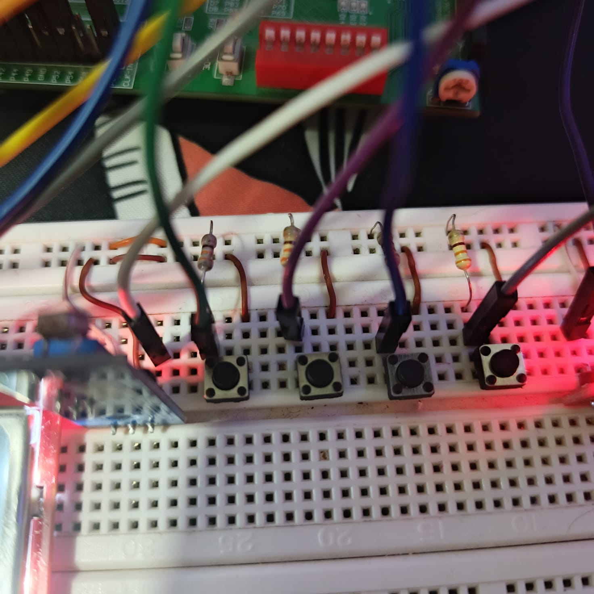
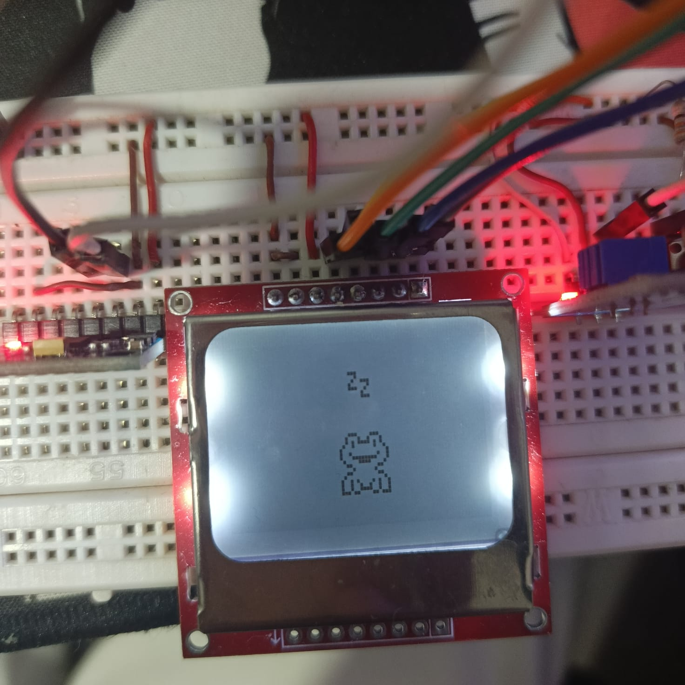
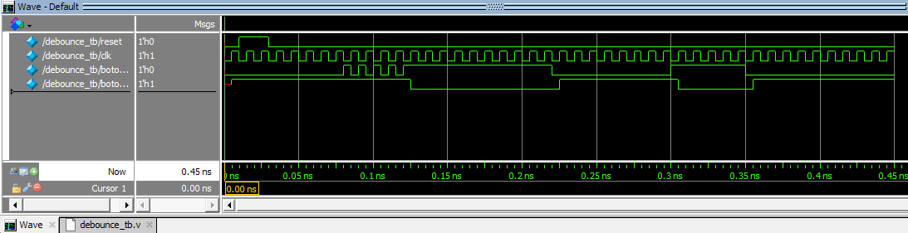
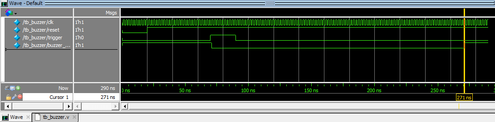
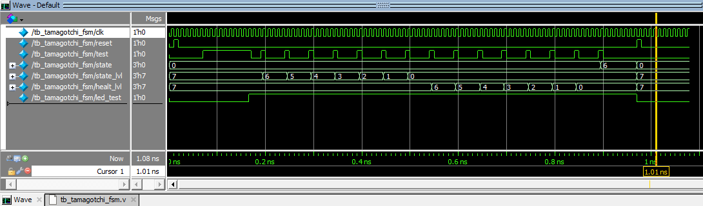
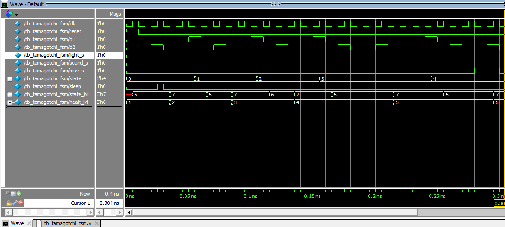
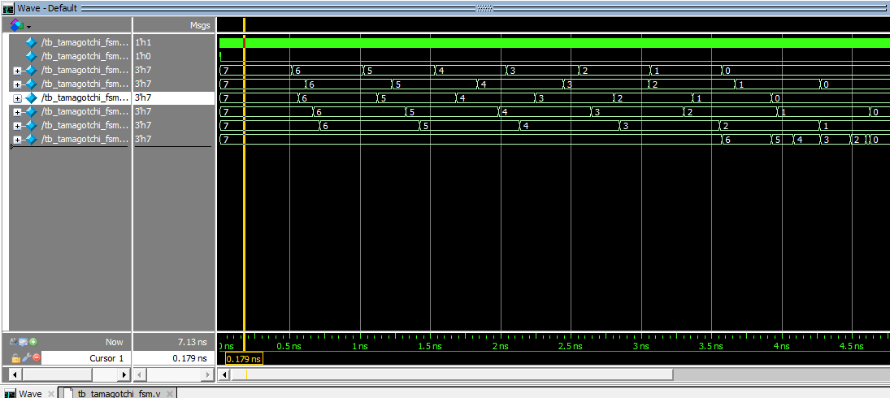
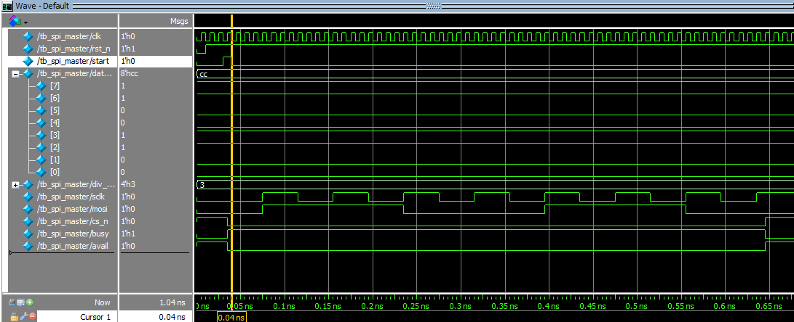

# Entrega 1 del proyecto WP01

* Alejandro Diaz Benavidez
* Yeison Dario Rojas Mora
* Johan Hernan Lopez Alonso

## 1. Objetivo
Desarrollar un sistema de Tamagotchi en FPGA (Field-Programmable Gate Array) que simule el cuidado de una mascota virtual. El diseño incorporará una lógica de estados para reflejar las diversas necesidades y condiciones de la mascota, junto con mecanismos de interacción a través de sensores y botones que permitan al usuario cuidar adecuadamente de ella.

### 1.1 Objetivos especificos:
* Aplicar las tematicas del curso de electronica digital I para diseñar e implementar un sistema de Tamagotchi en FPGA.
* Diseñar e mplementar la lógica de control del tamagotchi en verilog.
* Integrar y programar sensores y periféricos para la interacción del tamagotchi.

## 2. Delimitaciones
El alcance del proyecto se centra en la creación de un sistema básico de Tamagotchi, que incluirá:

* Una interfaz de usuario operada mediante cuatro botones físicos (rst, test y dos botones de acción).
* Tres sensores de interaccion: Sensor de sonido KY038; sensor de luz; Giroscopio MPU-6050.
* Un sistema de visualización compuesto por 4 matrices LED 8x8 y un 7seg para representar el estado actual y las necesidades de la mascota virtual.
El proyecto se diseñará e implementará utilizando la FPGA ciclone IV, con restricciones claras en términos de recursos de hardware disponibles. La implementación se detallará en Verilog.

## 3. Especificaciones de diseño

El proyecto Tamagotchi en FPGA sera un sistema diseñado para emular el cuidado de una mascota virtual, permitiendo al usuario participar en actividades esenciales para su salud. El usuario tendra como objetivo mantener a su mascota en un estado optimo mediante un grupo acciones recurrentes: alimentar, jugar, dormir y asear. 
El sistema notificara al usuario del estado y las necesidades de la mascota a través de una interfaz visual y una alarma. Para que el usuario interactue, el sistema contará con cuatro botones físicos y tres sensores.

### 3.1 Sistema de botones:
La interacción usuario-sistema se realizará mediante los siguientes botones configurados:
* __Reset:__  Reestablece el Tamagotchi a un estado inicial conocido al mantener pulsado el botón durante al menos 5 segundos. Este estado inicial simula el despertar de la mascota con salud óptima.
* __Test:__ Activa el modo de prueba al mantener pulsado por al menos 5 segundos, permitiendo al usuario modificar rapidamente los diferentes estados del Tamagotchi con cada pulsación del boton de test.
* __Botones de interaccion (2):__ Facilitan acciones directas como alimentar, jugar, descansar o bañar, posibilitando la implementación de actividades específicas para el bienestar del Tamagotchi. El botón de interacción (1) permitira al usuario navegar por los distintos estados del tamagotchi en los cuales el boton (2) permitirá realizar acciones especificas asociadas a dicho estado.
  
Se presenta la imagen de los cuatro botones usados:



### 3.2 Sistema de sensado:
Para integrar al Tamagotchi con el entorno real y enriquecer la experiencia de interacción, se incorporarán tres sensores que modifique el comportamiento de la mascota virtual en respuesta a estímulos externos:

* __Sensor de sonido KY038:__ Utilizado para que el tamagotchi responda a estimulos sonoros, si la intensidad de ruido es baja o moderada el tamagochi aumentara su felicidad.


* __Sensor de luz:__ Utilizado para controlar el estado de descanso de la mascota, si la intensidad luminica es muy alta el usuario no podrá enviar a descansar a la mascota. Si la intensidad luminica es muy baja por un tiempo determinado el Tamagotchi se dormirá y no permitirá interacciones.


 
* __Sensor de movimiento Giroscopio MPU-6050:__ Utilizado para sensar patrones de movimiento repetitivos que simulen actividad fisica de la mascota, aumentando su nivel de felicidad y salud.

### 3.3 Sistema de visualizacion:

* __Pantalla nokia 5110__ Pequeña pantalla gráfica LCD montada sobre una PCB de 4.5cm x 4.5cm. Posee una resolución de 84 x 48 pí­xeles sobre la que se pueden dibujar gráficos o textos. Representa visualmente el estado actual del Tamagotchi, incluyendo emociones y necesidades básicas.



* __Display de 7 Segmentos:__ Utilizado para mostrar niveles y puntuaciones específicas, como el nivel de hambre o felicidad, complementando la visualización principal.


* __Buzzer:__ Incorporado en la FPGA que emite sonidos dependiendo de los estados del Tamagotchi y avisando sobre eventos importantes o si el Tamagotchi se encuentra en un estado crítico.

## 4. Arquitectura del sistema:
### 4.1 Componentes:
* Display nokia 5110

* Buzzer

* Display de 7 segmentos

* Sensor de sonido KY038

* Sensor de luz 

* Sensor de movimiento MPU-6050

### 4.2 Descripción funcional de componentes:
* __Display Nokia 5110:__ Pequeña pantalla gráfica LCD montada sobre una PCB de 4.5 cm x 4.5 cm. Posee una resolución de 84 x 48 píxeles sobre la que se pueden dibujar gráficos o textos.
  * __Componentes principales:__
    * __LCD:__ La pantalla gráfica que permite dibujar y mostrar imágenes o texto.
    * __Controlador PCD8544:__ Un chip que facilita la interfaz entre el microcontrolador y la pantalla, permitiendo el control de los píxeles.
    * __Resistores:__ Para asegurar que los niveles de voltaje sean adecuados para la pantalla.
  * __Entradas y salidas:__
    * __VCC:__ Pin de alimentación (generalmente 3.3V).
    * __GND:__ Pin de conexión a tierra.
    * __SCE (Chip Enable):__ Pin para habilitar la comunicación con el display.
    * __RST (Reset):__ Pin para reiniciar el display.
    * __D/C (Data/Command):__ Pin que determina si se envía un comando o datos al display.
    * __DIN (Data In):__ Pin para la transmisión de datos.
    * __CLK (Clock):__ Pin para la señal de reloj que sincroniza la transmisión de datos.
  * __Función:__ El display Nokia 5110 se utiliza para mostrar gráficos o texto en diversas aplicaciones, como juegos o sistemas de monitoreo, y en el caso del Tamagotchi, muestra información sobre el estado, emociones o acciones del personaje.
  * 
* __Buzzer:__
Un buzzer es un dispositivo de salida que emite un sonido cuando se le aplica una corriente eléctrica.

  * __Componentes principales:__
    * __Elemento piezoeléctrico:__ La parte del buzzer que produce sonido cuando se deforma eléctricamente.
    * __Carcasa:__ Protege el elemento piezoeléctrico y amplifica el sonido.
  *__Entradas y salidas:__
    * __VCC:__ Pin de alimentación (generalmente 5V).
    * __GND:__ Pin de conexión a tierra.
    * __Pin de señal:__ Pin que recibe la señal de control para activar el buzzer.
  * __Función:__ El buzzer se utiliza para alertar al usuario de eventos importantes, como cuando el Tamagotchi necesita atención.

* __Display de 7 segmentos:__
Un display de 7 segmentos es un dispositivo de salida que puede mostrar dígitos del 0 al 9 usando siete segmentos LED que se encienden en diferentes combinaciones.

  * __Componentes principales:__
    * __Segmentos LED:__ Siete LEDs organizados en forma de número 8.
    * __Controlador de Display:__ Opcional, facilita el control de los segmentos individuales.
  * __Entradas y salidas:__
    * __VCC:__ Pin de alimentación (generalmente 5V).
    * __GND:__ Pin de conexión a tierra.
    * __Segmentos A-G:__ Pines para controlar cada uno de los siete segmentos.
    * __DP:__ Pin opcional para el punto decimal.
  * __Función:__
El display de 7 segmentos se utiliza para mostrar información numérica relevante, como el nivel de hambre, la felicidad, o el tiempo del Tamagotchi.

* __Sensor de sonido KY038:__ Es un módulo que permite detectar la presencia y la intensidad de sonidos en el entorno. Este módulo tiene dos salidas de información:
Analógica (A0): Lleva toda la información que está detectando el micrófono.
Digital(D0): Obtendremos una salida de encendido o apagado que se activa cuando el sonido supera un cierto volumen. Dicha salida de alta o baja se puede configurar mediante el ajuste del umbral.
  * __Componentes principales:__
    * __Microfono Electret__
    * __Potenciometro:__ Permite ajustar el umbral de sensibilidad para determinar el nivel de sonido necesario para activar la señal de salida.
    * __Comparador LM393:__ Se encarga de Comparar la señal del micrófono con el umbral ajustable, generando una señal digital de salida
    * __Indicadores LED:__ De alimentacion y señal digital de salida.
  * Entradas y salidas:
    * __VCC:__ Pin de alimentación (5V)
    * __GND:__ Pin de conexión a tierra.
    * ```DO (Digital Output)```: Pin de salida digital que se activa cuando el nivel de sonido supera el umbral ajustado.
    * ```AO (Analog Output)```: Pin de salida analógica que proporciona una señal proporcional a la intensidad del sonido detectado.

* __Modulo Sensor de luz con fotoresistor:__ Este modulo esta conformado por LDR o fotoresistor, el cual es sensible a la exposición de intensidad lumínica ambiental, para así determinar el brillo e intensidad lumínica del medio, este modulo a través de una salida digital, se puede programar un rango de luminosidad, proporcionando un nivel de tensión alto o bajo, dependiendo de la configuración preestablecida.
  * __Componentes principales:__
    * __Utiliza el comparador LM393 para mayor estabilidad__
    * __Potenciómetro__
    * __Leds de indicación__
  * Entradas y salidas:
    * __VCC:__ Pin de alimentación (3.3V)
    * __GND:__ Pin de conexión a tierra.
    * ```DO (Digital Output)```: Pin de salida digital que se activa cuando el nivel de luz supera el umbral ajustado.

* __Sensor de movimiento MPU-6050:__ Es un módulo avanzado que proporcionando una solución completa para la medición de la orientación y el movimiento. 
  * __Componentes principales:__
    * __Giroscopio de tres ejes__
    * __Acelerometro de tres ejes__
    * __Procesador de movimiento digital(DMP)__
    * El modulo cuenta con interfaz de comunicacion __I2C__.
  * Entradas y salidas:
    * __VCC:__ Pin de alimentación (3.3V - 5V)
    * __GND:__ Pin de conexión a tierra.
    * ```SCL (Serial Clock Line)```: Pin de reloj para la comunicación I2C.
    * ```SDA (Serial Data Line)```: Pin de datos para la comunicación I2C.
    * ```INT```: Pin de interrupción que puede ser configurado para notificar eventos específicos.
    
### 4.3 Interfaces de comunicacion:
En este proyecto se plantea usar 2 interfaces de comunicación, el I2C que se usa para comunicar los datos obtenidos de un giroscopio con la maquina de estados, asi mismo se usa el SPI el cual logra hacer la transmisión correcta de datos entre la maquina de estados y la pantalla nokia 5110, la cual muestra las caras de nuestro tamagotchi.

#### SPI (Serial Peripheral Interface)
- **Descripción:**
  - SPI es un protocolo de comunicación síncrona de alta velocidad utilizado principalmente para la comunicación entre microcontroladores y periféricos como sensores, tarjetas de memoria, y pantallas.
  
- **Características:**
  - **Full-Dúplex:** Permite la transmisión y recepción de datos simultáneamente.
  - **Cables:** Utiliza cuatro líneas de comunicación:
    - **MOSI (Master Out Slave In):** Línea de datos desde el maestro hacia el esclavo.
    - **MISO (Master In Slave Out):** Línea de datos desde el esclavo hacia el maestro.
    - **SCK (Serial Clock):** Reloj generado por el maestro para sincronizar la transmisión de datos.
    - **SS/CS (Slave Select/Chip Select):** Línea para seleccionar el esclavo activo.
  - **Velocidades:** Puede operar a velocidades de hasta varios MHz.
  - **Topología:** Un maestro y múltiples esclavos, seleccionados mediante la línea SS/CS.
  - **Sin direccionamiento:** No tiene un esquema de direccionamiento incorporado, lo que simplifica el hardware pero requiere una línea SS/CS por cada esclavo.

#### I2C (Inter-Integrated Circuit)
- **Descripción:**
  - I2C es un protocolo de comunicación síncrona que permite la comunicación entre múltiples dispositivos utilizando solo dos líneas de comunicación. Es muy utilizado para conectar microcontroladores con sensores y otros periféricos de baja velocidad.
  
- **Características:**
  - **Bidireccional:** Utiliza un bus de datos bidireccional compartido.
  - **Cables:** Utiliza dos líneas de comunicación:
    - **SDA (Serial Data Line):** Línea de datos bidireccional.
    - **SCL (Serial Clock Line):** Línea de reloj generada por el maestro para sincronizar la transmisión de datos.
  - **Velocidades:** Soporta varias velocidades de operación:
    - **Estándar:** 100 kHz.
    - **Rápido:** 400 kHz.
    - **Alta Velocidad:** 3.4 MHz.
  - **Multipunto:** Permite múltiples maestros y esclavos en el mismo bus.
  - **Direccionamiento:** Utiliza direcciones de 7 o 10 bits para identificar dispositivos esclavos.
  - **Protocolos de transferencia:** Soporta transferencias de datos simples y complejas, incluyendo lecturas y escrituras combinadas.

### 4.4 Diagramas de caja negra:
A continuaciion se muestra el diagrama de caja negra que se planteo al inicio del proyecto. Este era solo un prototipo de la maquina de estados principal. (Click para ver en LucidChart)

[](https://lucid.app/lucidchart/bbb5cb64-7045-4149-8ae4-b84de991304b/edit?invitationId=inv_c0b7014b-6840-4804-9726-d6e230216194&page=0_0##)

Seguidamente presentamos los diagramas de caja negra de cada uno de los modulos en los que se dividió el proyecto.


### 4.5 Diagrama de bloques:
En la siguiente imagen se presenta el diagrama de bloques inicial que se habia planteado el cual solo evidenciaba la maquina de estados principal, como se observa es bastante extenso. Asi mismo en los avances siguintes se intento realizar una mejor version y más entendible. (Click para ver en LucidChart)

[](https://lucid.app/lucidchart/bbb5cb64-7045-4149-8ae4-b84de991304b/edit?invitationId=inv_c0b7014b-6840-4804-9726-d6e230216194&page=PHj0tElPAV7X#)

## Diagrama de bloques Modulo FSM principal

Este diagrama de bloques describe la lógica principal del código con las decisiones clave, incluyendo el manejo de estados (como SLEEP, FOOD, BATH, etc.), el temporizador de prueba (test_timer), y la transición entre modos.

[](//www.plantuml.com/plantuml/png/xPR1Yjim48RlUehfPSco1BOjfR36PRU9omOsJMcsq5jGx0aHMDOYAL1ww1lrAVfYjHrvTnfPiIxDAJv5urypclaS-xyrbckxaoLhVp1sCwj4BdWfVdATi1kD1ct2n0P6xKz8KxY-1Bl52aRBFxyl6TGNtGHOPogKIVPtJ8dujAf35Y65zowwKQhmWcjkjrvGxep8lIZ-G9qBWzwDBVAo9qk-qnehMqUM3rdsfJi5pnlHjLjQ8L7JDHgxagh0mzYXiAr6erWQXD5dvQOpLuM2PkTUtmnp_QP_ajrzKZk5rxwCI9zxSytrYya6YkH3u0pqeWp7uyJJ_DjjNqLA9QeaPUdN7QvDqqouN0kkWSCqkvlsfpbuIC92-joy2nofAiI63KP9943pqs8n7OH9_abHB9t-ZFAaA3_UFTuFeYJlloYKJdzIb6UKys_BsMIG9VbinS4a6qv7yqmp-vvzdSoMsI1GuZYYcP8z_mNh6IjP-VR96R8KxXSFqzNZR9x1EEIbQBUIs3LtUNxmr_E2Y086CJ1jPvnpZH8hMzTzsHhCUNML7BHD1l3IX882spQ8uNpR6awuk80ErgizhTw1X8qb2u1lt8ftk05Z4qpMV2yZapNIOydS6pigczCUJzUzCY8pTl9ZITs0msmTOMFL4xkj5pjP_WK0)

## Diagrama de bloques Modulo FSM pet (Caras)

1. El sistema espera el comando de reinicio (reset) o el inicio (start).
2. Si start es alto, se inicializa la FSM_pet:
- En el estado INIT, se envían los comandos de configuración del LCD.
- Luego, pasa al estado WIPE para limpiar la pantalla.
- Posteriormente, según las entradas face e icon, se dibujan los gráficos correspondientes en la pantalla.
- Cada vez que se manda un comando o datos al LCD, se espera a que el módulo spi_master termine su tarea antes de continuar.

[](//www.plantuml.com/plantuml/png/VPBDRjD04CVl-nHpjAKUoZMXebAJIf4AGhI2epLTZvk1_J0xuo1u9vw25yDU1rXZw26nvcF--lzcvreKamxU6MLr13l6fuGUeIMuTSF723O6U8-9yT6HRE3s_dNJaveyPypctVv-_m32ekHnQxY3Af6Grg172b39Z--r0G3OEDisIHHUNi7bTaw9TP_AsD8KlVXLFNAdJQAdikMHjR5n20kTKMQTHAjyeiNi85yN7ITaLoH4Os_82K4LujdrNdfAc23ppcqJOmxXQZIx0irZdVXfJM2ZPmhVS9uyAogs4Gvl3Wz5zYPw36FwxcO754uyjI18pur7KKfGjQZOSBW0wzjwQtwFVZco8wZE0WA9H34eoQiQMFuoLZALwdaLcUUF9mfjrfwtiGBuS7YxBm3ksFUC2NeCYixXHB9skKED0drCCsJwlyTSXZRtLnrQkW2sCTIBhMp_3ORmUQ0IR_nv3WHLFe4Hyx9-dhDymuu3EYxUC1zA3efZMPL2ovsP_w_7p-3TJm00)

## Diagrama de bloques Modulo SPI Master
1. El módulo espera a que la señal start sea alta.
2. Una vez que start es alto, el módulo comienza la transmisión SPI:
- Carga los datos en un registro de desplazamiento (shift_reg).
- Alterna el reloj (sclk) para enviar los bits uno por uno a través de MOSI.
- Cuando se han enviado todos los bits, levanta la señal avail para indicar que está listo para una nueva transmisión.

[](//www.plantuml.com/plantuml/png/ZLFDYXD14BxFKvINPHSLPYyk94Rse88tGV4YOQXqzoIb_HEwUY8YFf8d7o4lvan3KetjcEIIgQz-lg-_xdhaX34DpZQ9aZNmcd0RqI5e0s_jy2M02Xu-OIJSMCCBu3rr3ZcPs3Ivjm40MBpXlOaO8KFBZ54Fjpc4rGhkuUO6K2Kwc2bixo3jZ1yBZh_kSdMUOfNk8YTuEJOi1SRSzpUw6VXxLNb0iXFO5g0o5U8q8DFMemw0e5MHuntrgOjcEpLfJDYHBrafTIeCFejyM3RdpBSTMGEtad-LZqbS7F8ynGMcQS2PxFF3MaXExYdxzSG5cWvTZog52C_XlhQld5xqhK22fuLL-MSiZufzk32Yj4vi6Ykct9Ffex2Xr9zhPc_xMaCk2nRAqluhQEiRbM1qkHRmxrVoGrI_MBJhP-28mq_flke8CZi_kZ0aAFsOqIBl-tzgPO7QkgfQgFaQMR0vEkCrzSq5L129ylf0DaQMxQE9ZZn2YkZP4TFnjuSFxzy9ToMezfTJs3V2-JZ-3Sx-0G00)

## Diagrama de bloques Modulo Movement detect:

El módulo `movement_detect` es responsable de detectar el movimiento basado en el registro `x_reg`, evaluando su magnitud y comparándola con un umbral.

1. **Inicialización**: Al comenzar, si `reset_n` está en bajo (reset activo), el diagrama establece `movement` a `1` y `rescan` a `0`, y luego detiene el flujo.
  
2. **Condición `internal_clk`**: Si `internal_clk` está activo, se evalúa la señal `completed`:
   - Si `completed` es `1`, el sistema:
     - Calcula la magnitud de `x_reg` utilizando la función `magnitude`.
     - Si la magnitud es mayor a 80 (`x_greater`), evalúa si el bit de signo de `x_reg[7]` es 0 para actualizar `movement`.
     - Establece `rescan` a `1`.
   - Si `completed` es `0`, simplemente se establece `rescan` a `0`.

Este flujo cubre el proceso completo de cómo se maneja la detección de movimiento y el reinicio de la exploración. 

[]

## Diagrama de bloques Modulo display_hex:
El módulo Verilog  `display_hex`, es un controlador para una pantalla de 7 segmentos que convierte números binarios en formato BCD (Decimal Codificado en Binario) y los muestra en la pantalla, utilizando un temporizador para alternar entre los dígitos.

1. **Inicialización:**
   - Las variables `cfreq`, `bcd`, `count` y `an` se inicializan en 0 o en su valor predeterminado.
   
2. **Reinicio:**
   - Si la señal `reset` está activa (`reset == 0`), todas las variables se reinician.

3. **Divisor de Frecuencia:**
   - El contador `cfreq` se incrementa con cada pulso de reloj (`clk`). Una vez que `cfreq[16]` es igual a 1, se genera una señal de habilitación (`enable`), lo que permite avanzar el conteo en `count`.

4. **Selección de Dígito:**
   - Dependiendo del valor de `count`, se selecciona una porción de 5 bits del número de entrada (`num[39:0]`) para mostrar en la pantalla de 7 segmentos.
   - Se actualiza la señal de habilitación del ánodo (`an`) para seleccionar cuál de los 8 dígitos en la pantalla está activo en ese momento.

### Detalles Importantes:
- El contador de frecuencia (`cfreq`) divide el reloj para controlar el tiempo en que se actualiza cada dígito en la pantalla.
- El contador `count` cicla entre 0 y 7, lo que permite activar uno de los 8 dígitos en cada ciclo.
- El valor actual de `count` determina cuál de los segmentos de `num` se muestra en el dígito correspondiente de la pantalla.
  


## Diagrama de bloques Modulo Debounce:

`debounce` que implementa el anti-rebote para un botón o el sensor de movimiento:

1. **Inicialización:**
   - Si `reset` está activo (0), se inicializa el contador (`counter = 0`) y la salida del botón se invierte con respecto a la entrada.
   
2. **Comparación del Estado del Botón:**
   - Se compara si el estado del botón de entrada (`boton_in`) es igual a la salida del botón (`boton_out`):
     - Si los estados son iguales, el sistema incrementa el contador.
     - Si no son iguales, el contador se reinicia.
   
3. **Actualización del Estado del Botón:**
   - Si el contador alcanza el valor de `COUNT_BOT`, se actualiza el estado del botón de salida (`boton_out`) para que sea igual al valor del botón de entrada (`boton_in`), indicando que el botón se ha estabilizado sin rebotes.
   
4. **Reinicio del Contador:**
   - Después de actualizar la salida, el contador se reinicia a 0.


## Diagrama de bloques Modulo Buzzer:

Este módulo activa el buzzer cuando se detecta un flanco de subida en la señal `trigger`, y lo mantiene activo por un tiempo determinado.

1. **Inicialización**: Al comienzo del flujo, las variables `counter`, `trigger_prev`, `active` y `buzzer_out` se inicializan. Si `reset` es 0, se reinician las variables y el diagrama se detiene.
   
2. **Condición de `trigger_posedge`**: Si se detecta un flanco de subida en `trigger`, el sistema:
   - Activa la señal `active`.
   - Resetea el contador a 0.
   - Activa el `buzzer_out` poniéndolo en bajo (buzzer encendido).
   
3. **Contador**: Mientras `active` sea 1, se incrementa el contador en cada ciclo de reloj.
   - Si el contador alcanza el límite (determinado por `CLK_FREQ * DURATION`), se desactiva el buzzer (`buzzer_out` se pone en alto) y `active` se resetea.
     
  
    


## 5 Especificaciones de diseño detalladas:
### 5.1 Modos de operacion:
#### 5.1.1 Modo Test
El modo Test permite a los usuarios y desarrolladores validar la funcionalidad del sistema y sus estados sin necesidad de seguir el flujo de operación normal. En este modo, se pueden forzar transiciones de estado específicas mediante pulsaciones del boton "Test", para verificar las respuestas del sistema y la visualización. Este modo es esencial durante la fase de desarrollo para pruebas rápidas y efectivas de nuevas características o para diagnóstico de problemas.

- **Activación:** Se ingresa al modo Test manteniendo pulsado el botón "Test" por un periodo de 5 segundos.

- **Funcionalidad:** Permite alterar manualmente los estados del Tamagotchi, para observar directamente las respuestas y animaciones asociadas.
Cuando el tamagotchi esta en modo test se encendera un led indicando que se encuentra en dicho modo:


### 5.1.2 Modo Normal
El Modo Normal es el estado de operación estándar del Tamagotchi, donde la interacción y respuesta a las necesidades de la mascota virtual dependen enteramente de las acciones del usuario.

- **Activación:** El sistema arranca por defecto en el Modo Normal tras el encendido o reinicio del dispositivo. No requiere una secuencia de activación especial, ya que es el modo de funcionamiento predeterminado.


### 5.2 Estados y transiciones:
#### 5.2.1 Estados:
* Salud

* Hambre

* Descanso/sueño

* Felicidad

* Higiene

* Condicion Fisica

* Muerto
  
#### 5.2.1 Transiciones:
#### Sistema de niveles:
Cada estado del tamagotchi tendra asociado un nivel de satisfaccion en escala del 0 al 7. Los niveles aumentan o disminuyen segun las interacciones del usuario y el transcurso del tiempo de la siguiente forma:

<table>
  <tr>
    <th>Nivel</th>
    <th>Interacción</th>
    <th>Inactividad</th>
  </tr>
  <tr>
    <td>0</td>
    <td>+1</td>
    <td>-1 salud </td>
  </tr>
  <tr>
    <td>1-6</td>
    <td>+1</td>
    <td>-1</td>
  </tr>
  </tr>
    <tr>
    <td>7</td>
    <td>-1 salud </td>
    <td>-1 y + 1 salud </td>
  </tr>
</table>

El estado de _descanso/sueño_ sera el estado inicial de la mascota. Pasado un perido de incatividad y dependiendo del nivel de luz, la mascota siempre regresara a el estado _dencanso/sueño_. Cuando la mascota acumula un tiempo de sueño de 5 segundos se considera como una interaccion y su nivel asociado se actualiza. 

La salud es el unico estado que no dependera del paso del tiempo o la interacción, en cambio su valor esta definido en funcion del nivel de los demas estados, si el valor asociado a cualquier estado llega o se encuentra al maximo sumara un nivel a la salud, un estado del 1-6 no tendra efecto sobre la salud al actualizarse y un estado de 0 restara un nivel al ser detectado y por permanecer en dicho valor. Si el valor de la salud llega a 0 automaticamente hay una transicion al estado __Muerto__. Una vez en el estado __Muerto__ la unica interacción posible sera usar el boton __reset__ para reiniciar la mascota.

#### Temporizadores:
El sistema contara con 5 temporizadores que se encargaran de generar cambios en los distintos estados de la mascota simulando el paso del tiempo. Cada estado tiene asociado un temporizador que contabilizara un intervalo determinado de tiempo a excepcion del estado __Salud__ y el estado __Muerto__, pasado este tiempo ocurrira un cambio en el nivel del estado y el contador se reiniciara.

| Temporizador    | Tiempo |
|-----------------|--------|
| Sleep time      | 180s   |
| Food time       | 60s    |
| Bath time       | 120s   |
| Fun time        | 90s    |
| Exercise time   | 150s   |


#### Interacciones:
Las interacciones del usuario pueden ser de dos tipos, cambio de estado y cuidado:
* Cambio de estado: El usuario presionara el boton (1) lo que le permitira navegar por los diferentes estados de la mascota, cada pulsacion mostrara el siguiente estado (en la secuencia hambre, sueño, felicidad, higiene, condicion), esta interaccion no afectara los niveles de estado ni los temporizadores.
* Cuidado: El ususario interactua ya sea con el boton (2) o con un sensor. Cada interaccion de cuidado afectara el nivel del estado activo de la mascota segun la tabla mostrada anteriormente.

##### Interacciones especiales:
Dentro de las interacciones de cuidado, existen acciones que requieren una secuencia de acciones especificas:
* Sueño: En el estado __Descanso__ la mascota puede encontrarse despierta o durmiendo, cuando el usuario presione el boton(2) la mascota intentara dormir, si el sensor detecta demasiada luz en el ambiente la mascota no podra dormir y se contara una interaccion negativa, si por el contrario hay oscuridad la mascota dormira por un interavalo de 5 segundos y finalizado el tiempo se contara una interaccion positiva.
* Diversion: En el estado __Felicidad__ el usuario debera presionar el boton (2) para activar una pequeña ventana de tiempo de 5 segundos de "escucha" durante este intervalo el tamagotchi leera la entrada del sensor de sonido, si el sensor detecta un sonido suficientemente alto para activar su señal de salida durante el intervalo de escucha, se otorgara una interaccion positiva mientras que si el sensor no se activa se tomara como una interaccion negativa.
* Ejercicio: En el estado __Condicion__ el boton (2) no perimitira ninguna interaccion, en cambio el usuario debera acelerar el dispositivo (o el sensor de movimiento) para interactuar con la mascota.

## Desarrollo y simulacion del modelo:

### Botones:
Para el uso de los cuatro botones que hemos definido __Reset__, __Test__, __b3__, __b4__ no es necesario crear un modulo especifico para su gestion, ya que al ser señales de 1 bit pueden ser leidas directamente por la FSM tamagotchi, sin embargo es crucial implementar un modulo de antirrebote para evitar un funcinamiento incorrecto de los mismos debido a cambios rapidos al momento de presionar los botones. El antirrebote debe evitar que la oscilacion incial de la señal de los botones sea leida como un conjunto de muchas pulsaciones rapidas por la FSM y en su lugar solo se detecte un flanco de subida por cada pulsacion. \\

 

Se desarrolló el siguiente modulo de antirrebote, en este modulo se establece un tiempo mínimo en el cual la señal de entrada debe permanecer en un valor fijo para ser reflejada en la salida:

```verilog
// antirebote  energia
always @(posedge clk) begin
	if (~reset)begin
		counter <=0;
		boton_out<=~boton_in;
	end else begin
		if (boton_in==boton_out) begin
			counter <= counter+1;			
		end else begin
			counter<=0;			
		end
		if (boton_in==0 && counter==COUNT_BOT)begin
 // 			boton_out<=~boton_out;
	 			boton_out<=1;
				counter<=0;		
		end
		if (boton_in==1 && counter==COUNT_BOT/100+1)begin
 // 			boton_out<=~boton_out;
	 			boton_out<=0;
				counter<=0;	
		end
```
Realizamos un testbench para comprobar el correcto funcionamiento del antirrebote:



En el resultado de la simulacion comprobamos que el modulo funciona correctamente negando los rebotes de la señal original, entregando una salida util para la FSM principal.
 

### Buzzer:

Para hacer uso del buzzer integrado de la FPGA necesitamos un modulo mediador que controle el tiempo que permanece activo el buzzer una vez la FSM principal ha generado un trigger:

```verilog
 always @(posedge clk or negedge reset) begin
        if (~reset) begin
            counter <= 0;
            trigger_prev <= 0;
            active <= 0;
            buzzer_out <= 1;  // Inicialmente inactivo (alto)
        end else begin
            trigger_prev <= trigger;

            if (trigger_posedge) begin
                active <= 1;
                counter <= 0;
                buzzer_out <= 0;  // Activa el buzzer (bajo)
            end else if (active) begin
                if (counter < CLK_FREQ * DURATION - 1) begin
                    counter <= counter + 1;
                end else begin
                    active <= 0;
                    buzzer_out <= 1;  // Desactiva el buzzer (alto)
                end
            end
        end
    end
```
Con esta logica podemos establecer un tiempo activo para el buzzer, al momento de la implementación lo estableceremos en el orden de los segundos, por último realizaremos una simulación para verificar el funcionamiento del modulo:

 

Observamos como el buzzer permanece activo unicamente por un intervalo previamente establecido de 200ns despues de recibir la señal de disparo.

### FSM principal:
La FSM principal del tamagotchi se encargara de toda la logica de cambios de estado previamente planteada, gestionando el sistema de sensado, contadores de tiempo transcurrido y entregando los datos a la visualizacion. Como esta logica es bastante extensa hemos decidido abordarla en diferentes bloques. 

#### Modo test:
Lo primero que hemos implementado es la logica del modo test del tamagotchi, el modo test se activa cuando se mantiene pulsado durante un intervalo definido de tiempo el boton __test__ , para notificar que el modo test esta activo usaremos un led de la FPGA y una vez en este modo, el boton test debe disminuir en 1 el nivel asociado al estado activo y si el nivel de estado esta en cero debe disminuir el nivel de salud de la mascota (reemplazando al contador de tiempo), adicionalmente tambien implementamos el reset y el cambio al estado muerto de la mascota para porbarlos en el mismo testbench.

```verilog
            // Test mode logic
            if (b2_deb && current != DEAD) begin
                if (test_timer == HOLD_TIME - 1) begin
                    test_mode <= ~test_mode;
                    test_timer <= 0;
                end else begin
                    test_timer <= test_timer + 1;
                end
            end else begin
                test_timer <= 0;
            end
             // Manual state changes (test mode)
            if (b2_posedge && test_mode && current != DEAD) begin
                case (current)
                    SLEEP:   	if (sleep_state == 3'd7) begin
                                    sleep_state <= sleep_state - 1;
                                    if (health_state < 3'd7) health_state <= health_state + 1;
                                end else if (sleep_state > 0) begin
                                    sleep_state <= sleep_state - 1;
                                end else if (health_state > 0) begin
                                    health_state <= health_state - 1;
                                end
										 
                    FOOD:    	if (food_state == 3'd7) begin
					.
                                        .
						
										 
                    BATH:    	if (bath_state == 3'd7) begin
                                        .
                                        .
					
										 
                    MUSIC:   	if (music_state == 3'd7) begin
                                        .
                                        .					
										 
                    EXERCISE:   if (exercise_state == 3'd7) begin
                                    exercise_state <= exercise_state - 1;
                                    if (health_state < 3'd7) health_state <= health_state + 1;
                                end else if (exercise_state > 0) begin
                                    exercise_state <= exercise_state - 1;
                                end else if (health_state > 0) begin
                                    health_state <= health_state - 1;
                                end
                endcase
            end
            
            // Check if health reaches 0
            if (health_state == 0) begin
                current <= DEAD;
            end
```


En la simulacion observamos como el modo test se activa correctamente (despues de mantener pulsado __test__ y activando el led) y una vez activo cada pulsacion de __test__ reduce los niveles de estado y salud de la mascota hasta llegar a 0, donde ocurre automaticamente un cambio al estado __Muerto__ y finalizamos con un reset que reestablece correctamente la mascota a su estado inicial.

#### Logica de estados:

Ahora probaremos la logica de estados del tamagotchi la cual permitira navegar por los estados del tamagotchi e interactuar con la mascota a travez de los botones de interaccion y los sensores. La mascota debe cambiar secuencialemten su estado activo con cada pulsacion de __b3__ y dependiendo del estado actual, el usuario podra interactuar con el tamagotchi por medio del boton __b4__ y los sensores. Para los estados de __Higiene__ y __Hambre__ cada pulsacionde __b4__ sumara 1 al nivel del estado, en el estado de __Condicion__ se interactua solo mediante el sensor de movimiento y en los estados restantes se necesita de la interaccion con ambos elemnetos, __b4__ y sensor. Tambien se incluye en la logica el aumento del nivel se salud cuando un nivel de estado alcanza su valor maximo.

```verilog
            // Mode switching
            if (b3_posedge && current != DEAD) begin
                case (current)
                    SLEEP: current <= FOOD;
                    FOOD: current <= BATH;
                    BATH: current <= MUSIC;
                    MUSIC: current <= EXERCISE;
                    EXERCISE: current <= SLEEP;
                    default: current <= SLEEP;
                endcase
            end
				
             // b4 logic
            if (b4_posedge && current != DEAD) begin
                case (current)
                    FOOD: begin
                        if (food_state < 3'd7) begin
                            food_state <= food_state + 1;
                            face <= 1;
                                                                         buzzer_trigger <= 1;
                            face_timer <= 0;
                        end else if (health_state > 0) begin
                            health_state <= health_state - 1;
                            face <= 2;
									 buzzer_trigger <= 1;
                            face_timer <= 0;
                        end
                    end
                    BATH: begin
                        .
                        .
                        .
                    end
                endcase
            end
				
             // b4 logic for SLEEP
            if (current == SLEEP && !sleep_hold_active) begin
                if (b4_posedge && light_sensor) begin
                    face <= 3;
                    sleep_hold_active <= 1;
                    sleep_hold_timer <= 0;
                end
            end

            // timer for SLEEP
            if (sleep_hold_active) begin
                if (sleep_hold_timer < HOLD_TIME - 1) begin
                    sleep_hold_timer <= sleep_hold_timer + 1;
                end else begin
                    sleep_hold_active <= 0;
                    sleep_hold_timer <= 0;
                    
                    // Apply logic after HOLD_TIME
                    if (sleep_state < 3'd7) begin
                        sleep_state <= sleep_state + 1;
                        face <= 1;
								buzzer_trigger <= 1;
                        face_timer <= 0;
                    end else if (health_state > 0) begin
                        health_state <= health_state - 1;
                        face <= 2;
								buzzer_trigger <= 1;
                        face_timer <= 0;
                    end
                end
            end
				
             // b4 logic for MUSIC
            if (current == MUSIC && !music_hold_active) begin
                if (b4_posedge) begin
                    music_hold_active <= 1;
                    music_hold_timer <= 0;
                    sound_detected <= 0;
                end
            end

            // timer and logic for MUSIC
            if (music_hold_active) begin
                if (music_hold_timer < HOLD_TIME - 1) begin
                    music_hold_timer <= music_hold_timer + 1;
                    
                    // Sound check after 1s
                    if (music_hold_timer >= ONE_SECOND) begin
                        if (sound_sensor == 0 && !sound_detected) begin
                            sound_detected <= 1;
                        end
                    end
                end else begin
                    music_hold_active <= 0;
                    
                    // Logic if sound detected
                    if (sound_detected) begin
                        if (music_state < 3'd7) begin
                            music_state <= music_state + 1;
                            face <= 1;
									 buzzer_trigger <= 1;
                            face_timer <= 0;
                        end else if (health_state > 0) begin
                            health_state <= health_state - 1;
                            face <= 2;
									 buzzer_trigger <= 1;
                            face_timer <= 0;
                        end
                    end
                    music_hold_timer <= 0;
                    sound_detected <= 0;
                end
            end
				
             // Logic for exercise
            if (current == EXERCISE && movement_posedge) begin
                        if (exercise_state < 3'd7) begin
                            exercise_state <= exercise_state + 1;
                            face <= 1;
									 buzzer_trigger <= 1;
                            face_timer <= 0;
                        end else if (health_state > 0) begin
                            health_state <= health_state - 1;
                            face <= 2;
									 buzzer_trigger <= 1;
                            face_timer <= 0;
                        end
                    end
```
Realizamos un testbench donde probamos la interaccion en todos los estados, para el testbench inicicializamos forzado los niveles de estado en 6 y el valor de salud en 1 para comprobar su funcionamiento:



La simulacion confirma el correcto funcionamiento de la logica de todos los estados asi como el correcto aumento en el nivel de vida de la mascota.

#### Detrimento de niveles por el paso del tiempo:

Se necesita implementar una logica que disminuya los niveles de los estados periodicamente con el paso del tiempo, para ello desarrolamos la siguiente logica. Definimos parametros de tiempo y contadores individulaes para cada estado y un contador adicional que se encargara de contabilizar el paso de un segundo, para simplificar. Cuando se complete un periodo de tiempo, el nivel de estado asociado debera disminuir su valor en 1, si el nivel de estado se encontraba al maximo, al decaer tambien se sumara 1 al nivel de salud, si el estado llega a 0 el nivel asociado a salud empezara a disminuir con cada periodo en el que algun nivel de estado permanezca en 0. 

```verilog

              // Timers (50MHz clock)
            localparam ONE_SECOND = 50_000_000;  // Clock cycles in one second
            localparam SLEEP_TIME = 180;  // 180 seconds
            localparam FOOD_TIME = 60;  // 60 seconds
            localparam BATH_TIME = 120;  // 120 seconds
            localparam MUSIC_TIME = 90;  // 90 seconds
            localparam EXERCISE_TIME = 150; // 150 seconds

             // State timers
            reg [27:0] second_counter;
            reg [7:0] sleep_timer, food_timer, bath_timer, music_timer, exercise_timer;

             // Second counter logic
            if (second_counter < ONE_SECOND - 1) begin
                second_counter <= second_counter + 1;
            end else begin
                second_counter <= 0;
                sleep_timer <= sleep_timer + 1; // Increment state timers every second
                .
                .
                exercise_timer <= exercise_timer + 1;
            end

             // State updates
            if (sleep_timer >= SLEEP_TIME) begin
                sleep_timer <= 0;
                if (sleep_state == 3'd7) begin
                    sleep_state <= sleep_state - 1;
                    if (health_state < 3'd7) health_state <= health_state + 1;
                end else if (sleep_state > 0) begin
                    sleep_state <= sleep_state - 1;
                end else if (health_state > 0) begin
                    health_state <= health_state - 1;
                end
            end
            
            .
            .
            .
            
            if (exercise_timer >= EXERCISE_TIME) begin
                exercise_timer <= 0;
                if (exercise_state == 3'd7) begin
                    exercise_state <= exercise_state - 1;
                    if (health_state < 3'd7) health_state <= health_state + 1;
                end else if (exercise_state > 0) begin
                    exercise_state <= exercise_state - 1;
                end else if (health_state > 0) begin
                    health_state <= health_state - 1;
                end
            end
```
Realizamos un testbench para observar el comportamiento de los niveles de estado segun avanza el tiempo (ajustaremos los intervalos de tiempo al orden de ps). 

Encontramos que la logica implementada cumple satisfactoriamente su funcion disminuyendo los niveles de estado segun las especificacions, vemos como si la mascota es desatendida por completo al cabo de un tiempo su salud empezara a decaer rapidamente hasta llegar a 0 y morir (ya que se acumulan varios niveles de estado en 0).

### Interfaz SPI:

La interfaz SPI es crucial para la visualizacion de los estados del tamagotchi, para comprobar que todo funcione correctamente ejecutamos la siguiente simulacion donde usamos el SPI para enviar un valor de prueba arbitrario:



Observamos que una vez se dispara start, el SPI comunica efectivamente la informacion de entrada de forma secuencial. 

## Implemetacion del prototipo:

[


